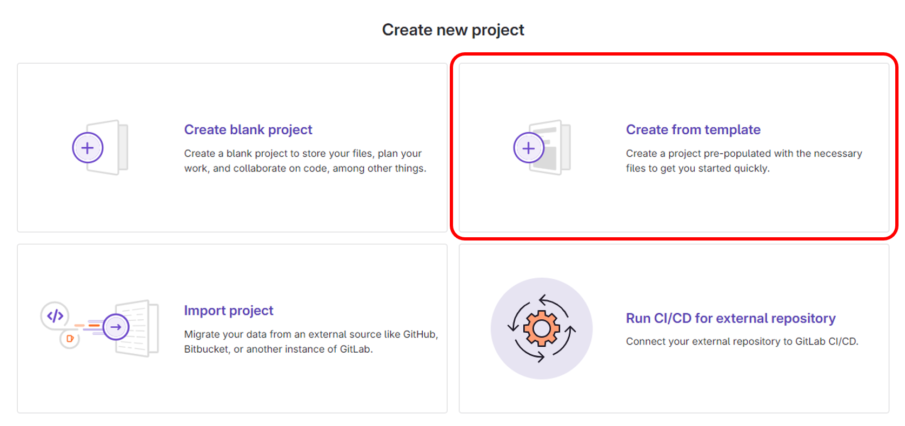
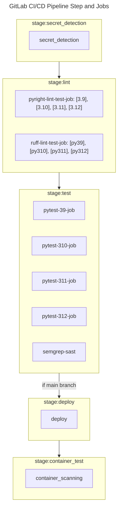

# Python FastAPI Template

[](https://www.python.org/downloads/)
[](https://fastapi.tiangolo.com/release-notes/#01110)
[](https://loguru.readthedocs.io/en/stable/project/changelog.html)
[](https://gunicorn.readthedocs.io/en/stable/project/changelog.html)
[](https://gitlab.com/wisenut-research/lab/starter/python-fastapi-template/-/graphs/main/charts)
[](https://gitlab.com/wisenut-research/lab/starter/python-fastapi-template/commits/main)

> **빠르고 쉽게 파이썬 기반의 HTTP API 웹 서버를 개발하기 위한 템플릿**  
> (API 명세는 와이즈넛 [Restful API 디자인 가이드](https://docs.google.com/document/d/1tSniwfrVaTIaTT4MxhBRAmv-S_ECcoSFAXlYrsg4K0Y/edit#heading=h.60fu2rc04bck)를 따른다)

Python FastAPI Template 은 아래와 같은 특징을 갖고 있다.

1. **Python 3.9, 3.10, 3.11, 3.12**: 높은 호환성
2. **MSA 환경을 고려한 Cloud Native Application 설계**: [THE TWELVE-FACTOR APP](https://12factor.net/)
3. **간편한 Logging 설정**: [loguru](https://github.com/Delgan/loguru)
4. **최신 의존성 관리 툴 Poetry**: `pyproject.toml`으로 한 번에 관리
5. **App Properties Management**: 환경 변수를 통한 전체적인 프로젝트 변수를 간단하게 관리 ([.env](./.env))
6. **Containerizing with Gitlab CI**:
    - (Cloud Environment) 배포에 사용할 `Dockerfile`
    - (Non-Cloud environment) 분산 처리를 위한 Gunicorn 프리셋 구성을 위한 `gunicorn.Dockerfile`
    - 로컬에서 빠른 개발 환경 구동을 위한 `dev.Dockerfile`
7. **Gunicorn**: multi process 환경 구성
8. **파이썬 앱 개발부터 배포까지 필요한 GitOps와 문서 템플릿 제공**: secret detection, lint test(ruff, pyright, hadolint), unit test(pytest, SAST), deploy, container scanning

### Requirements

- [Python](https://www.python.org/) `>=3.9,<=3.12`
- [Poetry](https://python-poetry.org/) `>= 1.4`
- [FastAPI Web Framework](https://fastapi.tiangolo.com/ko/)

## Quick start


### 0. Create Project from template

> 빠른 프로젝트 생성을 위한 GitLab Template 사용법
> 

   1. GitLab `Create new project` 을 통해 새로운 프로젝트 생성
   2. `Create from template` 선택    
      
   3. `Group` 선택
   4. **FastAPI**에서 `Use template` 선택    
      
   5. _Project name, Project description (optional)_ 등을 작성하고 `Create project` 선택

> 🔴 **GitLab CI/CD Container Registry Deploy**를 위해 프로젝트 생성시 무조건 `Settings > Repository > Deploy tokens`에 **gitlab-deploy-token** 이름으로 `read_registry, write_registry` Scope 선택해서 토큰 생성하기
> 

### 1. Install Requirements

```bash
$ apt-get install -y python39 && python3 --version && pip3 --version
$ pip3 isntall -U poetry
```

### 2. Install Dependencies

```bash
$ poetry install --no-root
```

### 3. Run app

[방법 1] 가상환경 자동 진입

```bash
$ poetry run uvicorn app.main:app --host 0.0.0.0 --port <port number>
```

[방법 2] 가상환경 직접 진입

```bash
# 가상환경 활성화 후 FastAPI uvicorn 실행
$ poetry shell
(python-fastapi-template-py3.9) $ uvicorn app.main:app --host 0.0.0.0 --port <port number>
```

## Quick start with Docker

```bash
$ docker build -t python-fastapi-template:dev -f dev.Dockerfile .
$ docker run -d --rm --name python-fastapi-template -p 8000:8000 -e X_TOKEN=wisenut python-fastapi-template:dev
```

---

## Project Description

> 프로젝트 생성, 환경 세팅, 실행방법, 앱 구조, GitLab CI/CD 파이프라인, Gunicorn 및 내부망 환경에 대해  
> 더 자세히 알고싶으면 아래 토글을 열어서 확인하세요.

<details>
<summary> Click here for more details </summary>
<div>

## Getting started

### 1. Create Project
>
> 총 3가지 방법이 존재함 (제일 사용하기 편한 방법은 Quick Start 방식 확인)

1. **Create blank project**
   1. GitLab `Create new project` 을 통해 새로운 프로젝트 생성
   2. _Project name, Project description (optional)_ 등을 작성하고 `Create project` 선택
   3. Python FastAPI Template을 Download source code (zip, tar.gz, tar.bz2, tar)를 통해 받아서 Push
2. **Create project using fork**
   1. `Create new Fork` or `Fork`를 통해서 새로운 프로젝트 생성
   2. _Project name, Project description (optional)_ 등을 작성하고 `Fork Project` 선택
   3. 프로젝트 생성 후 Fork 해제
      Fork를 해제하지 않으면 새로 생성한 프로젝트의 MR이 Python FastAPI Template에 올라오거나 Issue를 통해 Create merge request 불가

### 2. Development Environment Setting

1. 로컬 개발 환경에 `git clone ...`
2. Pycharm 을 열고 `open project ...`
3. Interpreter Setting
   - **Poetry**
     > requirements: Poetry 설치 ([Poetry docs](https://python-poetry.org/docs/#installation) 참고)
     - **`poetry install --no-root`**
     - PyCharm으로 진행할 경우
       1. **Add New Interpreter** 선택
       2. **Add Local Interpreter** 선택
       3. **Poetry Environment** 선택
       4. Python version에 맞게 환경 설정 (현재는 3.9.13 사용중)
       5. **Install packages from pyproject.toml** 체크
          - `UnicodeError` 발생 할 경우, **Settings > Editor > Global Encoding, Project Encoding, Properties Files** 모두 'UTF-8' 로 설정
          - 🐛 해결이 안 될 경우, `Install packages from pyproject.toml` 체크 표시 해제하고 poetry 가상환경 생성한 후 poetry venv 터미널에 `poetry install --no-root`로 직접 의존성 설치
       6. **OK** 선택
     - `poetry show`로 의존성이 제대로 설치됐는지 확인
   - _Virtualenv (deprecated)_
     1. **Add New Interpreter** 선택
     2. **Add Local Interpreter** 선택
     3. **Virtualenv Environment** 선택
     4. 로컬에 설치된 Python 경로를 Base Interpreter 로 설정
     5. `pip install .` (`pyproject.toml`에 작성한 의존성 설치, 아래 **3. Extra Setting** 참고)

## 3. Extra Setting (Optional)

### `config.py` 및 `.env`
>
> 환경 변수로 앱 구동 및 관련 설정 진행
> 환경 변수 우선순위: 환경변수 외부 주입 및 설정 > `.env`에 설정한 값 > `config.py` 디폴트값

- `PORT`: fastapi server port
- `SERVICE_NAME`: 서비스명
- `SERVICE_CODE`: 서비스코드
- `MAJOR_VERSION`: API 메이저 버전
- `STATUS`: API 상태 (개발용: `dev`, 배포용: `prod`)
- 로그 관련 설정: [loguru](https://github.com/Delgan/loguru) 사용하여 로그 세팅
  - `LEVEL`: 로그 레벨 설정
  - `JSON_LOG`: stdout 형식 JSON 출력 여부 결정 (로그 저장도 해당 형식으로 진행됨)
  - `LOGURU_FORMAT`: 로그 포맷팅 설정
    - loguru 라이브러리를 사용해서 환경변수로 설정이 가능하다.
    - 자세한 로그 포맷은 [loguru 공식 문서](https://loguru.readthedocs.io/en/stable/api/logger.html#record)에서 확인 바람
  - `SAVE`: 로그 파일 저장 여부
  - `LOG_SAVE_PATH`: 디렉토리명까지 설정, (default = `YYYY/MM/*.log` 디렉토리 생성)
  - `ROTATION`: 매일 `mm:ss`시에 새로운 로그 파일 생성
  - `RETENTION`: 설정한 시간 이후에 제거 (ex. "1 month 2 weeks", "10h")
  - `COMPRESSION`: 압축 형식 ("gz", "bz2", "xz", "lzma", "tar", "tar.gz", "tar.bz2", "tar.xz", "zip" 등의 형식 지원)
    > `ROTATION`, `RETENTION`, `COMPRESSION`, `LOGURU_FORMAT` 모두 loguru에 있는 파라미터로 자세한 파라미터 정보는 [공식 문서](https://loguru.readthedocs.io/en/stable/api/logger.html#file:~:text=See%20datetime.datetime-,The%20time%20formatting,-To%20use%20your) 확인
- 서비스 관련 설정
  - `X_TOKEN`: API 사용을 위한 토큰값 설정
- 추가로 환경변수로 설정해서 내부에서 사용할 변수가 있다면`config.py`에 추가하고, 환경변수(주입 or `.env`)로 설정하여 사용

### Docker run

- ❗ 도커 빌드 및 실행할 경우, `version.py` 실행 사전 작업 필수 ❗
  (없을 경우에도 정상작동 되지만 필요한 정보를 볼 수 없음)
  👉 `version_info.py` 정보 생성 과정

  ```python
  service: str = 'Python FastAPI Template'
  version: str = 'v1.2408.08-dev-733a810'
  git_branch: str = 'main'
  git_revision: str = '733a810bff5c29e4f7ffa6f27d2d57991491f895'
  git_short_revision: str = '733a810'
  build_date: str = '2024-08-08 11:25:03'
  ```

- `pyproject.toml` 작성 (참고: [Declaring project metadata](https://packaging.python.org/en/latest/specifications/declaring-project-metadata/))
  - project 메타데이터 작성 (_name_, _version_, ... etc)
  - 의존성 작성: `tool.poetry.dependencies`
    - `poetry add ${package-name-to-add}`로 추가하면 자동으로 `pyproject.toml` 파일에 의존성이 추가됨
    - 자세한 사항은 [Poetry 공식 문서](https://python-poetry.org/docs/#installation) 참고

### 4. Run

- local run
  - poetry 가상환경에 진입하지 않았을 경우, 아래 명령어들 중 하나 실행
    - `poetry run python $HOME/app/main.py`
    - `poetry run uvicorn app.main:app --host 0.0.0.0 --port <port number>`
  - poetry 가상환경에 진입할 경우
    1. 가상환경 진입: `poetry shell`
    2. 위 명령어에서 `poetry run` 제외하고 그대로 실행 (ex. `uvicorn app.main:app --host 0.0.0.0 --port <port number>`)
  - `FileNotFoundError` or `ImportError` 발생시 _Working Directory_ (Working Directory = `$HOME`) 확인하기
  - _<http://localhost:8000/openapi.json>_ or _<http://localhost:8000/docs>_ 로 API 명세 확인 및 테스트
- docker run (dev)
  `docker build ...` && `docker run -d -p ...` 로 컨테이너 빌드 & 구동

  ```bash
  # 도커 이미지 빌드
  docker build -t python-fastapi-template:dev -f dev.Dockerfile .
  # 컨테이너 구동
  docker run -d --rm --name python-fastapi-template -p 8000:8000 -e X_TOKEN=wisenut python-fastapi-template:dev
  ```

## 📚 MSA
>
> @tiangolo(FastAPI 개발자)가 제공하는 유형(ex. api, crud, 모델, 스키마)별로 파일을 구분하는 프로젝트 구조

- 출처: <https://fastapi.tiangolo.com/tutorial/bigger-applications/>

```
.
├── .gitlab
│   ├── ci      # GitLab CI Jobs 모음집
│   ├── issue_templates     # 이슈 템플릿으로 이슈 생성시 용도별로 선택해서 사용 가능 
│   ├── merge_request_templates     # MR 템플릿 (현재는 branch 기준 MR 생성해서 사용하므로 템플릿을 사용하진 않아서 파일이 없음)
│   ├── CODEOWNERS      # 코드 소유자 명시 (파일별로 MR에서 그룹 및 사용자를 자동으로 Reviewer로 설정 가능)
│   └── secret-detection-rulset.toml        # GitLab CI의 첫 단계에서 진행하는 Secret Detection에 추가로 설정할 Rule Set
├── app                  # "app" is a Python package
│   └── api          # (API Endpoints) "routers" is a "Python subpackage" 
│   │   ├── examples    # 라우터에 사용할 예제들 정의
│   │   ├── __init__.py
│   │   ├── items.py
│   │   └── users.py
│   └── exceptions
│   │   ├── __init__.py
│   │   ├── base.py     # 앱에서 발생하는 내부 에러 기본 포맷
│   │   └── service.py     # base.py를 활용하여 앱에서 발생하는 내부 에러들 정의
│   └── schemas          # Pydantic model 설정
│   │   ├── __init__.py
│   │   ├── items.py
│   │   └── users.py
│   └── src         # (Main Functions) "src" is a "Python subpackage"
│   │   ├── items   # items 관련 로직 소스 코드
│   │   ├── users   # users 관련 로직 소스 코드
│   │   └── __init__.py 
│   └── utils         # 외부 도구 모음
│   │   ├── __init__.py   # users 관련 로직 소스 코드
│   │   └── authenticaiton.py   # 권한 관련 설정
│   ├── __init__.py
│   ├── config.py   # 앱 내부에서 사용할 변수들 설정 (환경변수를 통해서 값을 받아올 수 있음)
│   ├── constants.py   # 상수 설정
│   ├── dependencies.py     # 라우터 관련 의존성 설정
│   ├── handlers.py  # fastapi handlers 정의 (정의 후 main.py에 추가해야함)
│   ├── log.py  # 로그 관련 설정
│   ├── main.py     # main
│   └── version.py  # 버전 관련 정보 생성 및 전달 파일 (앱 실행 전에 해당 파일 수행해서 version_info.py 생성해야함)
├── static  # static files
│   └── guide   # README.md에 가이드 작성을 위한 static 파일들 모음
├── tests   # app directory architecture 에 맞게 unit test 구성
│   └── api
│   │   ├── __init__.py
│   │   ├── test_items.py     # items 관련 API Call 단위테스트
│   │   └── test_users.py     # users 관련 API Call 단위테스트
│   └── src
│   │   ├── __init__.py
│   │   ├── items   # items 관련 로직 단위테스트
│   │   └── users  # users 관련 로직 단위테스트
│   ├── __init__.py
│   ├── check_common_conditions.py      # router unit test 공통 확인 사항, 필요할 경우 추가 공통 테스트 추가해도 됨
│   ├── conftest.py     # pytest conf file
│   └── test_main.py
```

- **api**: API Endpoint. 작성한 API들은 `$HOME/app/main.py`에 router를 추가한다. (ex. `app.include_router(users.router)`)
- **src**: 모듈 메인 기능
- unit test
  - 👉 유닛 테스트는 기본적으로 `$HOME/app`의 디렉토리 구조에 맞게 구성한다.
  - 유닛 테스트 종류로는 기능 테스트, API 엔드포인트 테스트, Pydantic 모델 유효성 테스트, 보안 테스트가 있다.
- **Dockerfile**
  - `dev.Dockerfile`: 개발을 위해 필요한 도구 및 라이브러리와 같은 추가적인 종속성을 설치하기 위한 라이브러리들이 설치된 환경
  - `Dockerfile`, `guinicorn.Dockerfile`: 최종 제품을 배포하기 위해 필요한 것들만 포함한 환경

## GitLab CI/CD Pipeline



# Guide for each environment

## Multi Process
>
> **Gunicorn 사용**

### What is Gunicorn?
>
> Gunicorn의 프로세스는 프로세스 기반의 처리 방식을 채택하고 있으며, 이는 내부적으로 크게 master process와 worker process로 나뉘어 집니다.
> Gunicorn이 실행되면, 그 프로세스 자체가 master process이며, fork를 사용하여 설정에 부여된 worker 수대로 worker process가 생성 됩니다.
> master process는 worker process를 관리하는 역할을 하고, worker process는 웹어플리케이션을 임포트하며, 요청을 받아 웹어플리케이션 코드로 전달하여 처리하도록 하는 역할을 합니다.

- Gunicorn 적용
  - Before: FastAPI 단독 실행 (Uvicorn 서버로 실행) = 1 process 로 TA 모듈 서버 구동
  - After: Gunicorn으로 FastAPI 다중 실행 (n*worker) = n+1 process (= 1*master + n*worker) 로 TA 모듈 서버 구동

### How to use Gunicorn

```bash
# 의존성 설치
(venv) pip install --extra-index-url https://download.pytorch.org/whl/cpu .[gunicorn]
# 실행
gunicorn --bind 0:8000 --max-requests 20 -w 4 -k uvicorn.workers.UvicornWorker app.main:app
```

- Gunicorn 설정 참고
  - 기본 옵션 설명
    - `-w ${num_of_worker}`: request 를 처리할 app 을 지정된 워커 수 만큼 생성 미지정시 1
    - `--bind 0:8000`: `host:port` 형태로 바인딩할 소켓을 지정. 미지정시 `['127.0.0.1:8000']`
    - `-k uvicorn.workers.UvicornWorker`: fastapi 구동을 위한 설정이므로 워커 클래스는 `uvicorn`으로 고정해서 사용
    - `--max-requests 1000`: 각 워커에 해당 설정값 이상으로 요청이 몰릴 경우 다시 시작하여 메모리 누수 방지
    - 자세한 설정 옵션은 [Gunicorn 공식 문서 Settings](https://docs.gunicorn.org/en/stable/settings.html) 참고
  - 커맨드로 옵션을 설정할 수 있지만 편리성을 위해 Gunicorn 설정파일인 `gunicorn.conf.py`에서 진행한다.
    - Configuration File은 `./gunicorn.conf.py`가 디폴트로 설정되어있고, 다른 경로를 설정하고 싶은 경우, `-c CONFIG` or `--config CONFIG`로 설정한다.
    - 자세한 사용법은 하단 링크 참고
      - <https://github.com/benoitc/gunicorn/blob/master/examples/example_config.py>
      - <https://zetawiki.com/wiki/Gunicorn.conf.py>
- 주의사항
  - 요청이 올 수 있는 수준으로 최적값으로 설정하여 필요 이상으로 설정할 경우 OOM 발생
  - 공식문서를 참고하여 사용 환경에 맞는 설정 필요

# 📚 참고 사항 📚
>
> @tiangolo 가 제공하는 유형(예: api, crud, 모델, 스키마)별로 파일을 구분하는 프로젝트 구조는 범위가 적은 마이크로 서비스 또는 프로젝트에 적합하지만 많은 도메인이 있는 모놀리식에는 맞출 수 없다.
> 더 확장 가능하고 진화할 수 있는 구조는 Netflix의 Dispatch 에서 영감을 얻었다.
> 출처: <https://github.com/zhanymkanov/fastapi-best-practices>

# Automation Bot

> Automation bot은 각종 이슈, 에픽, MR 등을 분류하고 관리합니다. 미리 설정한 규칙에 따라 행동하며 사용자의 휴먼 에러를 포착하고, 그에 대한 피드백을 제공합니다.
기본적으로 CI를 통해 활성화하고, 특정 이벤트의 발생이나 미리 설정된 스케줄에 따라 동작합니다.

<br>

- Gitlab triage
  > Gitlab의 Epics, Issues, MR, Branch 등을 사용자 정의 규칙을 설정을 통해 분류하여, 그룹이나 프로젝트 단위에서 Issue나 MR의 분류를 자동화하는 것을 목표로 합니다.
- Danger review
  > MR이 생성되거나 변경사항이 발생하는 경우, 미리 설정한 규칙을 지키지 않은 경우, 이를 comment로 경고합니다. comment는 danger-bot이 동작할 때마다 comment를 추가하지 않고, 수정합니다.


## Requirements - Gitlab triage

**API** Scope의 최소 **Reporter** 권한을 가진 Access Token을 생성 후, **API_TOKEN** 이름으로 CI/CD 변수를 생성합니다.
> Access Token의 이름은 생성된 bot의 이름이 됩니다.
```
- component: $CI_SERVER_FQDN/components/gitlab-triage/gitlab-triage@0.1.2
    inputs:
      ...
      # $API_TOKEN bot 실행을 위한 access token 이름
      api_token: $API_TOKEN
```

## Requirements - Danger review
**API** Scope의 최소 **Maintainer** 권한을 가진 Access Token을 생성 후, **DANGER_GITLAB_API_TOKEN** 이름으로 CI/CD 변수를 생성합니다.
> Access Token의 이름은 생성된 bot의 이름이 됩니다.

Danger review 1.4.1 기준, 해당 변수는 적용되지 않으므로 **DANGER_GITLAB_API_TOKEN** 이름으로 CI/CD 변수를 생성하세요.

```
- component: gitlab.com/gitlab-org/components/danger-review/danger-review@1.4.1
    inputs:
      gitlab_api_token_variable_name: $DANGER_GITLAB_API_TOKEN
```

</div>
</details>