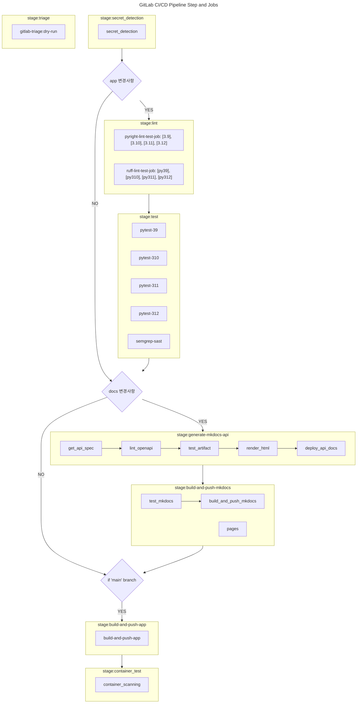

# GitLab CI/CD Pipeline

```mermaid
---
title: GitLab CI/CD Pipeline Step and Jobs
---
flowchart TD
    subgraph stage:secret_detection
	secret_detection
	end
	
    subgraph stage:lint
    pyright-lint["pyright-lint-test-job: [3.9], [3.10], [3.11], [3.12]"]
    ruff-lint["ruff-lint-test-job: [py39], [py310], [py311], [py312]"]
    end
	  
    subgraph stage:test
    pytest-39
    pytest-310
    pytest-311
    pytest-312
    semgrep-sast
    end
    
    subgraph stage:container_test
    container_scanning
    end
    
    subgraph stage:build-and-push-app
    build-and-push-app
    end
    
    subgraph stage:triage
    gitlab-triage:dry-run
    end
    
    subgraph stage:generate-mkdocs-api
    direction LR
    get_api_spec --> lint_openapi --> test_artifact --> render_html --> deploy_api_docs
    end
    
    subgraph stage:build-and-push-mkdocs
    test_mkdocs --> build_and_push_mkdocs
    pages
    end
    
    app-change-decision@{ shape: diamond, label: "app 변경사항" }
    docs-change-decision@{ shape: diamond, label: "docs 변경사항" }
    main-branch-decision@{ shape: diamond, label: "if 'main' branch" }
    
    stage:secret_detection --> app-change-decision
    app-change-decision -- "YES" --> stage:lint
    stage:lint --> stage:test
    app-change-decision -- "NO" --> docs-change-decision
    stage:test --> docs-change-decision
    docs-change-decision -- "YES" --> stage:generate-mkdocs-api --> stage:build-and-push-mkdocs --> main-branch-decision
    docs-change-decision -- "NO" -->  main-branch-decision
    main-branch-decision -- "YES" --> stage:build-and-push-app
    stage:build-and-push-app --> stage:container_test
```
