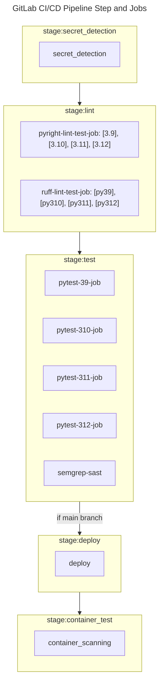

## GitLab CI/CD Pipeline

```mermaid
---
title: GitLab CI/CD Pipeline Step and Jobs
---
flowchart TD
    subgraph stage:secret_detection
    secret_detection
    end
    
    subgraph stage:lint
    pyright-lint["pyright-lint-test-job: [3.9], [3.10], [3.11], [3.12]"]
    ruff-lint["ruff-lint-test-job: [py39], [py310], [py311], [py312]"]
    end
   
    subgraph stage:test
    pytest-39-job
    pytest-310-job
    pytest-311-job
    pytest-312-job
    semgrep-sast
    end
    
    subgraph stage:container_test
    container_scanning
    end
    
    subgraph stage:deploy
    deploy
    end
    
    stage:secret_detection--> stage:lint
    stage:lint--> stage:test
    stage:test -- "if main branch" --> stage:deploy
    stage:deploy --> stage:container_test
```
