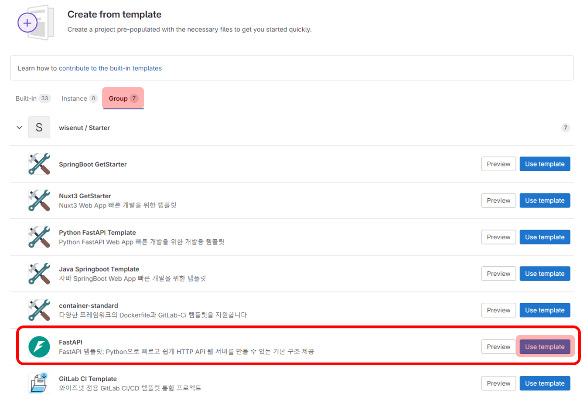

# Quick start


## 0. Create Project from template

> 빠른 프로젝트 생성을 위한 GitLab Template 사용법

1. GitLab `Create new project` 을 통해 새로운 프로젝트 생성
2. `Create from template` 선택    
    
3. `Group` 선택
4. **FastAPI**에서 `Use template` 선택 
   
5. _Project name, Project description (optional)_ 등을 작성하고 `Create project` 선택

## 1. Install Requirements

```bash
$ apt-get install -y python39 && python3 --version && pip3 --version
$ pip3 isntall -U poetry
```

## 2. Install Dependencies

```bash
$ poetry install --no-root
```

## 3. Run app

### [방법 1] 가상환경 자동 진입

```bash
$ poetry run uvicorn app.main:app --host 0.0.0.0 --port <port number>
```

### [방법 2] 가상환경 직접 진입

```bash
# 가상환경 활성화 후 FastAPI uvicorn 실행
$ poetry shell
(python-fastapi-template-py3.9) $ uvicorn app.main:app --host 0.0.0.0 --port <port number>
```

## Quick start with Docker

```bash
$ docker build -t python-fastapi-template:dev -f dev.Dockerfile .
$ docker run -d --rm --name python-fastapi-template -p 8000:8000 -e X_TOKEN=wisenut python-fastapi-template:dev
```